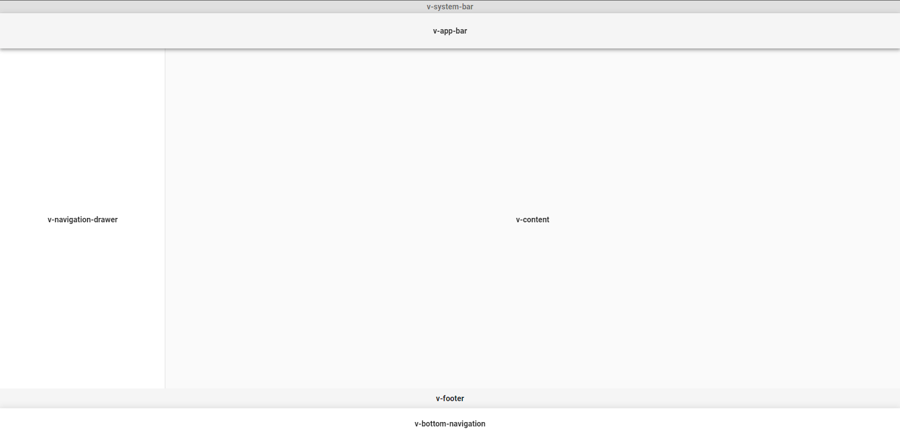

# Our-Sci PWA

Our-Sci PWA is a Progressive Web App (PWA) for creating and collecting surveys, see [development demo here](https://dev.our-sci.net).

## Development Quickstart

### Development Server

For development, you will need:
- this repository, *d'uh*
- the [our-sci-server](https://gitlab.com/our-sci/our-sci-server) repository
- A [mongoDB](https://www.mongodb.com/) server (preferably running on localhost)
- [node](https://nodejs.org/en/) & [yarn](https://yarnpkg.com/)

Start VueJS front-end on [http://localhost:8080](http://localhost:8080)
```
cd ~/repos/oursci/our-sci-pwa
yarn
yarn serve
```

Start Node.js back-end on [http://localhost:3000](http://localhost:3000)
```
cd ~/repos/oursci/our-sci-server
yarn
yarn start
```

You can now **view the webapp on your local machine** under [http://localhost:8080](http://localhost:8080)!

**Note:** Let's say your local machine has IP address `192.168.1.66`, then you can access the webapp from another computer or mobile phone under [http://192.168.1.66:8080](http://192.168.1.66:8080). In order for the **communication between front-end and back-end API** to work, you also need to **create a local environment file**, and adjust `VUE_APP_API_URL` with your current IP address.
```
$ cp .env.development .env.development.local
$ gedit .env.development.local
...
VUE_APP_API_URL=http://192.168.1.66:3000/api
```
The above `.env.development.local` file is **not commited** to git.

### Production build

You can try a production build by building the VueJS front-end, which will end up in `our-sci-pwa/dist`. The [our-sci-server](https://gitlab.com/our-sci/our-sci-server) repository should be next to the `our-sci-pwa`, and it will statically serve `../our-sci-pwa/dist`.

```
# Make sure our-sci-pwa and our-sci-server are in the same directory
$ cd ~/repos/oursci
$ ls
our-sci-pwa
our-sci-server
adorablePuppies.exe
...

# Build front-end production dist folder
$ cd our-sci-pwa
$ yarn build

# Start back-end server which statically serves ../our-sci-pwa/dist
$ cd our-sci-server
$ yarn
$ yarn start
```

You can now view the webapp under [http://localhost:3000](http://localhost:3000) (or your local IP address instead of localhost).

## Deployment

For deploying to the [current development server](https://dev.our-sci.net), run the update script from the [our-sci-server](https://gitlab.com/our-sci/our-sci-server) repository:
```
# Make sure repositories are synced
$ cd ~/repos/oursci
$ cd our-sci-pwa
$ git pull
$ cd ..
$ cd our-sci-server
$ git pull

# Run the update script
$ cd ~/repos/oursci/our-sci-server
$ scripts/update-server.sh
```

In order for this to work, you will need **oursci-allround.pem** inside `~/.ssh/oursci-allround.pem`.

## Deployment QA

We have a list of manual QA testing before pushing changes to the production server [linked here](/wikis/Deployment-Manual-QA).

Read and follow the QA prior to deployment, and add as features are expanded or better examples or test cases become available.

## Coding guidelines

Our-Sci PWA adheres to airbnb coding style guidelines. For development, we recommend using Visual Studio Code with the following workspace settings under `.vscode/settings.json`:

```
{
    "prettier.requireConfig": true,
    "eslint.run": "onType",
    "eslint.autoFixOnSave": true,
    "eslint.validate": [
        "javascript",
        {
            "language": "vue",
            "autoFix": true
        },
    ],
    "editor.codeActionsOnSave": {
        "source.fixAll.eslint": true
    },
    "vetur.format.defaultFormatter.js": "vscode-typescript",
    "vetur.format.defaultFormatter.html": "js-beautify-html",
}
```

> **NOTE:** This settings file is not commited to git, so feel free to customize. **Edit** 3 Feb 2020: It is now commited anyway

The above config disables prettier (if installed) as we do not use a .prettierrc config file. Otherwise prettier and eslint keep battling each other... There may be a better approach, but for now this will do. Also you may need to **disable Prettier for this workspace** since there is currently (Jan 2020) a bug, where Prettier formatting is applied anyhow even though there is no prettier config file.

Furthermore, we recommend using the [Vetur](https://vuejs.github.io/vetur) extension for Visual Studio Code. We are using the following settings **Default Formatters** for Vetur (vetur.format.defaultFormatter)
- CSS = prettier
- HTML = **js-beautify-html**
- JS = prettier
- LESS = prettier
- Postcss = prettier
- SCSS = prettier
- Stylus = stylus-supremacy
- TS = prettier


## Vuetify

This project uses Vuetify 

Have a look at the official [documentation on application](https://vuetifyjs.com/en/components/application) to see how the following components work together:
- [v-app-bar](https://vuetifyjs.com/components/app-bars)
- [v-bottom-navigation](https://vuetifyjs.com/components/bottom-navigation)
- [v-footer](https://vuetifyjs.com/components/footer)
- [v-navigation-drawer](https://vuetifyjs.com/components/navigation-drawers)
- [v-system-bar](https://vuetifyjs.com/components/system-bars)

Basically, the following layout is used:


## Increment Version

Run `yarn version --patch` or `yarn version --minor` to create a new version. Also don't forget to push the new tag `git push origin master --tags`
